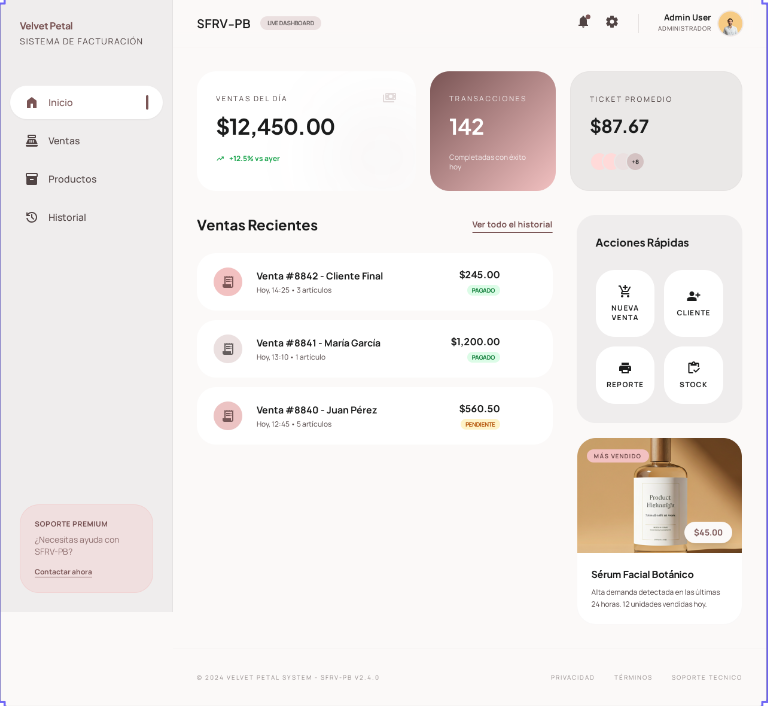
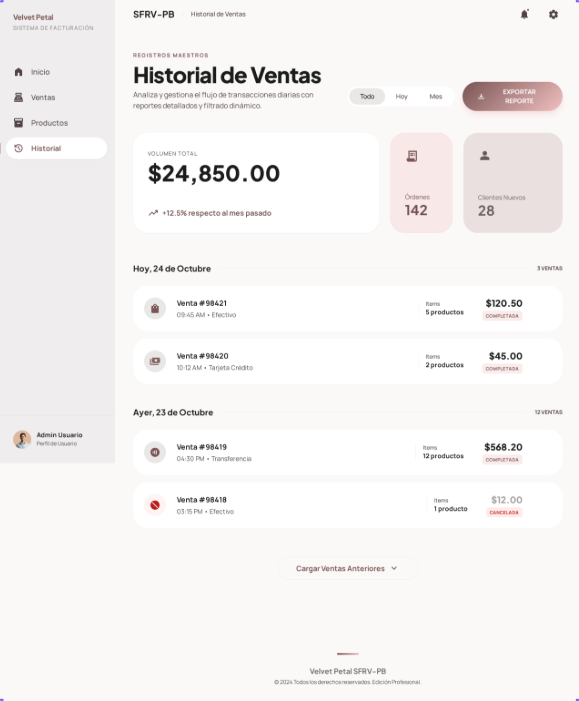

# Sistema de Facturación y Registro de Ventas para Productos de Belleza (SFRV-PB) 
Introducción

En muchos pequeños negocios, especialmente en aquellos dedicados a la venta de productos de belleza, el control de ventas y el registro de productos suele realizarse de forma manual o mediante herramientas básicas, lo que puede generar desorganización en la información y dificultades para consultar el historial de ventas.

Con el fin de mejorar la gestión administrativa del negocio, se desarrolló el Sistema de Facturación y Registro de Ventas para Productos de Belleza (SFRV-PB), una aplicación sencilla que permite registrar ventas, generar facturas automáticamente y mantener un historial organizado de las transacciones realizadas.

Este sistema está diseñado como una herramienta de apoyo para un negocio familiar, facilitando tareas básicas como el registro de productos, el control de ventas y la consulta de información comercial de manera rápida y ordenada. Además, su diseño busca ser simple e intuitivo, permitiendo que los usuarios puedan utilizarlo fácilmente sin requerir conocimientos técnicos avanzados.

De esta manera, el sistema contribuye a mejorar la organización del negocio, optimizar el registro de las ventas diarias y brindar un mejor control sobre la información relacionada con los productos y las transacciones realizadas.
<h1 align="center">Inicio</h1>

  

<h1 align="center">Facturación</h1>

  

<h1 align="center">Inventario</h1>

  

 <h1 align="center">Historial</h1>

 
  

Vista principal del Sistema de Facturación y Registro de Ventas.
 
 <h1 align="center">Diagrama Entidad - Relación</h1>

  

Especificaciones Técnicas

El Sistema de Ventas e Inventario de Productos de Belleza ha sido desarrollado utilizando tecnologías web modernas orientadas a entornos empresariales. Para su correcta instalación y ejecución, el equipo técnico debe contar con un sistema operativo compatible como Ubuntu 20.04 o superior, Windows 10/11 o macOS 12+, además de tener instalados Node.js versión 18 o superior, npm versión 9 o superior, SQL Server 2019 o superior, Git versión 2.30 o superior, y un navegador actualizado como Google Chrome, Microsoft Edge o Mozilla Firefox. El sistema está construido con HTML5, CSS3 y JavaScript en el frontend, mientras que el backend utiliza Node.js con Express, integrando además librerías como cors, bcrypt, jsonwebtoken y mssql para manejo de seguridad, autenticación y conexión con base de datos.

Antes de ejecutar el software, es necesario instalar todas las dependencias del proyecto mediante el comando npm install, lo que descargará automáticamente los paquetes requeridos definidos en el proyecto. La base de datos debe configurarse previamente importando el archivo Ingenieriaaa.sql en SQL Server, creando primero una base de datos vacía y luego ejecutando dicho script para generar tablas, relaciones y datos iniciales. Posteriormente, debe configurarse la conexión al servidor SQL definiendo variables como servidor, nombre de base de datos, usuario, contraseña, puerto y clave JWT, preferiblemente dentro de un archivo .env con parámetros como DB_SERVER, DB_DATABASE, DB_USER, DB_PASSWORD, DB_PORT y JWT_SECRET.

Para iniciar el sistema, el backend debe ejecutarse desde terminal con el comando node server.js o alternativamente nodemon server.js si se desea reinicio automático durante desarrollo. Una vez iniciado el servidor, el frontend puede abrirse ejecutando el archivo login.html directamente en navegador o mediante un servidor local como http-server. Por defecto, la aplicación opera sobre http://localhost:3000, utilizando rutas API bajo el prefijo /api. La estructura del proyecto incluye archivos principales como app.js, login.html, inicioo.html, Inventario.html, Historial.html, el script de base de datos Ingenieriaaa.sql, carpeta de imágenes y dependencias instaladas en node_modules.

En entornos de producción se recomienda desplegar el backend en Azure App Service, la base de datos en Azure SQL Database y el frontend en Azure Static Web Apps, especialmente si se implementará mediante Azure for Students. En cuanto a seguridad, el sistema incorpora autenticación mediante JWT, cifrado de contraseñas con bcrypt y protección de sesiones mediante sessionStorage. Finalmente, por buenas prácticas de desarrollo, no debe subirse la carpeta node_modules ni archivos sensibles como .env al repositorio GitHub; ambos deben incluirse dentro del archivo .gitignore para proteger credenciales y optimizar el control de versiones.
